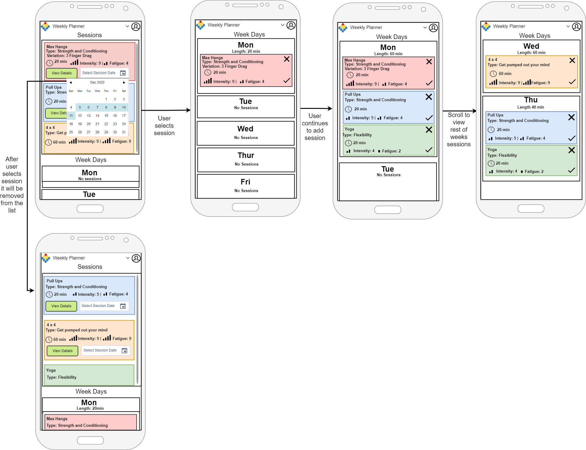
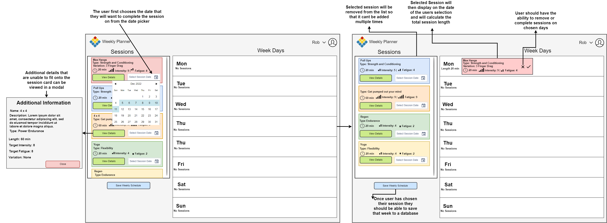

# Task Notes

### Additional Project made with VueJS through NPM can be found here with improvements
- Repo: https://github.com/rib1356/weekplanner-cli
- URL: https://rib1356.github.io/weekplanner-cli/

### Inital Plans
- Create basic wireframe ✔️
- Finalise wireframe ✔️
- Create flow diagram
- Fork and clone repository ✔️
- Import any of the necessary dependencies I will be using ✔️
- Create the inital layout of the page that should be responsive (session list and weekly log) ✔️
- Add functionality to select a session and add to chosen day ✔️
- Add functionality to remove a session from a chosen day ✔️
- Finalise mobile design/styling ✔️
- Finalise desktop design/styling ✔️

### Additional Changes
- Create vueJS Cli project ✔️
- Read from json file locally ✔️
- Create necessary components ✔️
- Incorporate components into layout ✔️
- Link repository to Firebase
- Design Firebase database
- Initialise Firebase database within project
- Save week session into database
- Add vue-router for navigation between pages
- Create history view for saved weekly sessions

### Future Changes
- Add saving for the weeks session
  - This could be done by writing to a new json file or overwriting the current data.json
  - Alternatively a simple database could be created (Either SQL or NoSQL) to store this information against a user (Firebase?)
- UI/UX Improvements
  - The ability to drag and drop sessions from the left column onto the table to add a session
  - Add notes to each of the sessions or days
  - History view of previous weeks sessions completed

## Inital Wireframes
#### Mobile View

#### Desktop View

## Finalised Wireframes
#### Mobile View

#### Desktop View

## Flow Diagrams
#### Mobile View

#### Desktop View

